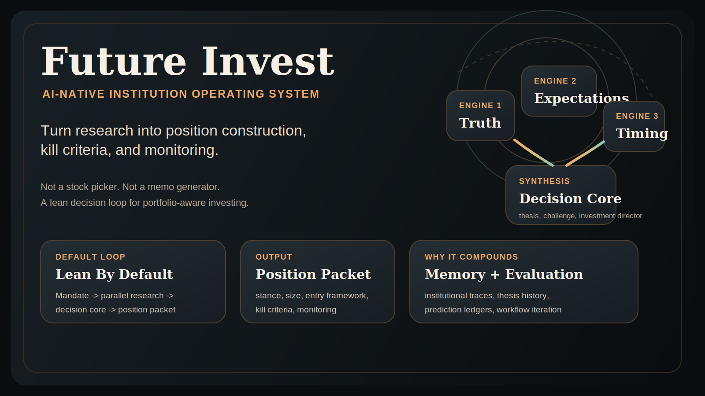
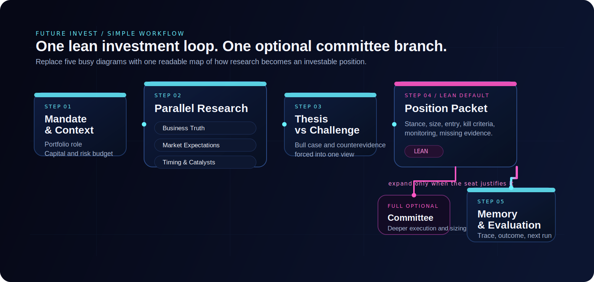

# Future Invest

Future Invest is an AI-native institution operating system for turning research into position construction, kill criteria, and monitoring.

<div align="center">

Not a stock picker. Not a memo generator. A lean decision loop for portfolio-aware investing.

🚀 [Why It Matters](#why-it-matters) | ⚡ [Quickstart](#5-minute-quickstart) | 🧠 [How It Works](#how-it-works) | 🖥️ [Interfaces](#interfaces) | 📦 [Python Runtime](#python-runtime) | 🗂️ [Project Index](PROJECT_INDEX.md)

</div>

<p align="center">
  
</p>

## Why It Matters

Most finance agents stop at analysis.

Future Invest is built around a harder endpoint:

`mandate -> research -> thesis vs challenge -> position packet`

That packet is the product. Instead of ending with "here is my memo," Future Invest tries to end with:

- `stance`
- `size`
- `entry framework`
- `kill criteria`
- `monitoring triggers`

This repo is for AI builders who want something more opinionated than a finance chatbot and more operational than a research copilot.

### Why It Gets Attention

- It is built around an institutional decision loop, not a generic question-answer flow.
- It compresses output into a position-construction packet instead of a long narrative memo.
- It introduces portfolio context before conviction hardens.
- It keeps a persistent memory layer so runs can compound over time.
- It includes an evaluation harness, so workflow quality can be tested rather than guessed.

### Why It Feels Different

| Category | Typical Research Agent | Future Invest |
| --- | --- | --- |
| Unit of work | Answer or memo | Institutional decision loop |
| Final artifact | Research narrative | Position packet |
| Reasoning structure | Single-run assistant | Orchestrated debate + synthesis |
| Portfolio context | Usually late or implicit | Introduced before thesis formation |
| Memory | Mostly stateless | Institutional memory across runs |

> Future Invest is designed for research and workflow prototyping. It is not financial, investment, or trading advice.

## What You Get

One successful run is supposed to feel less like "analysis complete" and more like "a seat is ready to discuss."

Example packet shape:

```yaml
stance: long
variant: market underestimates earnings durability
portfolio_role: core growth seat
size: medium
entry_framework: build on weakness around catalyst window
kill_criteria:
  - thesis breaks if demand normalization stalls for two quarters
  - cut if catalyst path slips and expectations reset higher anyway
monitoring:
  - estimate revisions
  - positioning and crowding
  - next catalyst date
missing_evidence:
  - channel check quality
  - management credibility under new guidance
```

## 5-Minute Quickstart

1. Clone and install:
   ```bash
   git clone https://github.com/welcomemyworld/TradingAgents.git future-invest
   cd future-invest
   pip install -e .
   ```
2. Set your provider key:
   ```bash
   export OPENAI_API_KEY=...
   ```
3. Launch the product:
   ```bash
   future-invest
   # or
   future-invest-web
   ```
4. Choose your provider, model pair, and loop mode in the CLI or web control room.

### Provider Paths

Future Invest is bring-your-own-provider. Use the path that matches your account, quota, and model access.

| Provider | `llm_provider` | `backend_url` | Auth |
| --- | --- | --- | --- |
| OpenAI | `openai` | `https://api.openai.com/v1` | `OPENAI_API_KEY` |
| VectorEngine | `vectorengine` | `https://api.vectorengine.ai/v1` | `VECTORENGINE_API_KEY` or `OPENAI_API_KEY` |
| OpenRouter | `openrouter` | `https://openrouter.ai/api/v1` | `OPENROUTER_API_KEY` |
| Google | `google` | `https://generativelanguage.googleapis.com/v1` | `GOOGLE_API_KEY` |
| Anthropic | `anthropic` | `https://api.anthropic.com/` | `ANTHROPIC_API_KEY` |
| xAI | `xai` | `https://api.x.ai/v1` | `XAI_API_KEY` |
| Ollama | `ollama` | `http://localhost:11434/v1` | local runtime |

Example config shape:

```yaml
llm_provider: openai
backend_url: https://api.openai.com/v1
quick_think_llm: gpt-5-mini
deep_think_llm: gpt-5.4
institutional_loop_mode: lean
run_mode: hard_loop
selected_analysts:
  - business_truth
  - market_expectations
  - timing_catalyst
```

If your provider is rate-limited, retry the same lean configuration before increasing loop depth.

## How It Works

Future Invest is built as an AI-native institution rather than a collection of isolated analysts.

The loop is intentionally short:

- `Mandate & Context`: define the portfolio role, capital budget, and risk budget
- `Parallel Research`: run `Business Truth`, `Market Expectations`, and `Timing & Catalysts` at the same time
- `Thesis vs Challenge`: force the bull case and counterevidence into one view
- `Position Packet`: emit stance, size, entry framework, kill criteria, monitoring, and missing evidence
- `Memory & Evaluation`: write back the run trace and what the system should learn next

Lean mode stops at the position packet. Full mode adds a committee branch only when the seat is important enough to justify the extra work.

<p align="center">
  
</p>

### What Keeps Compounding

- institutional memory
- prediction ledgers
- run traces
- evaluation against repeatable case sets

## Interfaces

### CLI

```bash
future-invest
python -m cli.main
```

The CLI is the main operator surface. It lets you choose:

- provider and model pair
- lean vs full loop depth
- capability stack
- mandate intensity and run posture

A legacy CLI alias still exists for backward compatibility, but the product surface is Future Invest.

### Web Control Room

```bash
future-invest-web
# or
python -m futureinvest_web.app
```

Then open `http://127.0.0.1:8000`.

The web control room uses the same runtime as the CLI, but renders the institution dossier in a lean-first interface with an optional full committee path.

## Evaluation

Future Invest includes a batch evaluation path so workflow quality can be measured.

Run the publish-facing smoke tests from the repo root:

```bash
python -m unittest \
  tests.test_investment_orchestration \
  tests.test_state_schema_consolidation \
  tests.test_evaluation_harness \
  tests.test_institutional_memory
```

For broader experiments, see:

- [PROJECT_INDEX.md](PROJECT_INDEX.md)
- [evaluation/README.md](evaluation/README.md)
- [docs/future-invest-proposal.md](docs/future-invest-proposal.md)

## Python Runtime

Future Invest uses LangGraph to keep the institution modular, inspectable, and reroutable.

The public brand is Future Invest. The current Python package path remains `tradingagents` for compatibility.

Example:

```python
from tradingagents.graph.trading_graph import FutureInvestGraph
from tradingagents.default_config import DEFAULT_CONFIG

graph = FutureInvestGraph(debug=True, config=DEFAULT_CONFIG.copy())
_, decision = graph.propagate("NVDA", "2026-01-15")
print(decision)
```

You can adjust the runtime configuration to change:

- provider and backend URL
- quick and deep model pair
- capability selection
- debate depth
- lean vs full institutional loop mode

See `tradingagents/default_config.py` for the full configuration surface.

## Repo Map

- [PROJECT_INDEX.md](PROJECT_INDEX.md): fastest way to find the important files
- [docs/future-invest-proposal.md](docs/future-invest-proposal.md): proposal-style framing
- [docs/future-invest-pitch-memo.md](docs/future-invest-pitch-memo.md): pitch-oriented positioning memo
- [docs/github-launch-checklist.md](docs/github-launch-checklist.md): release checklist
- [docs/github-upload-guide.md](docs/github-upload-guide.md): what should and should not be committed

## Contributing

Contributions are most useful when they improve one of these layers:

- institution design
- research quality
- decision protocol quality
- evaluation quality
- operator experience

## Citation

If you build on Future Invest, please cite the repository:

```bibtex
@software{futureinvest2026,
  author = {{Future Invest Project}},
  title = {Future Invest: AI-Native Institution Operating System},
  year = {2026},
  url = {https://github.com/welcomemyworld/TradingAgents},
  note = {GitHub repository}
}
```
