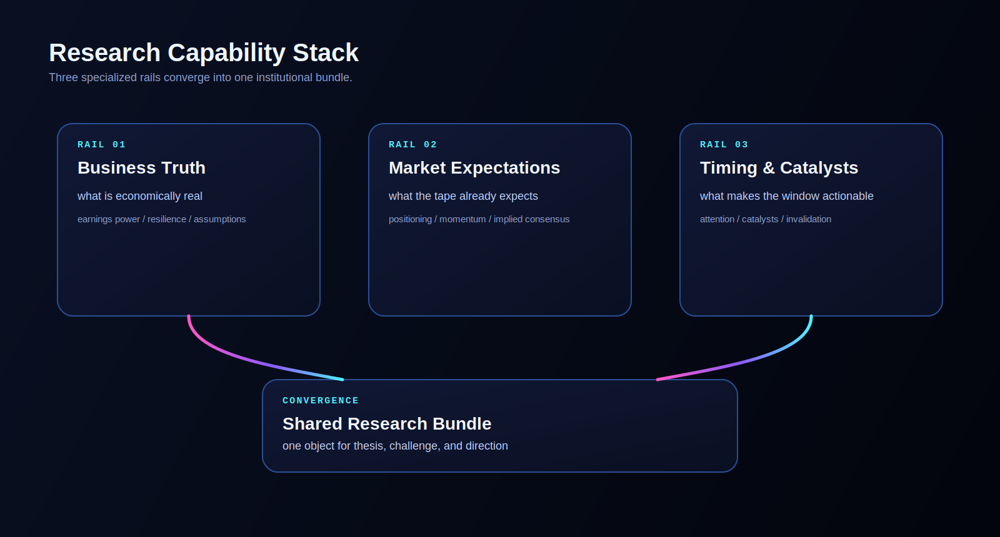
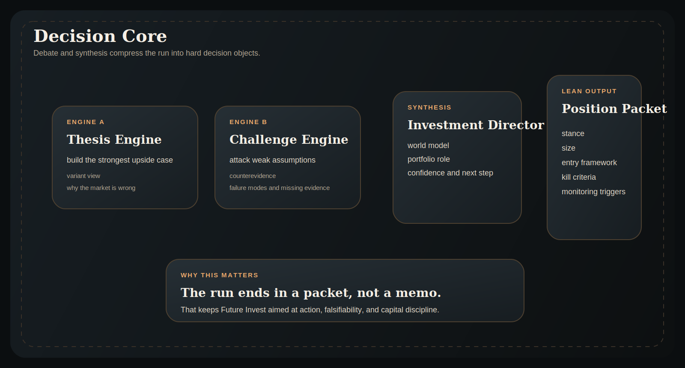
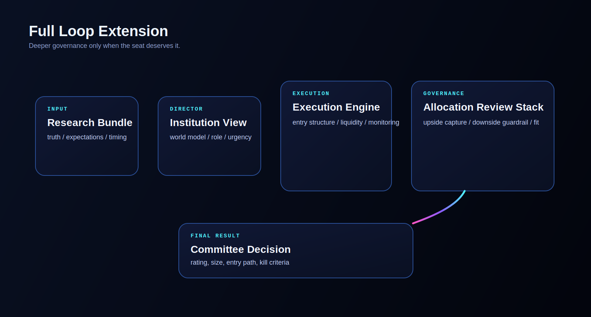
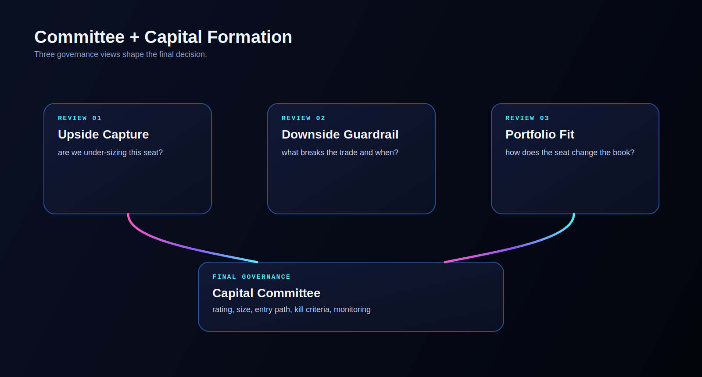

# Future Invest

Future Invest is an AI-native institution operating system for turning research into position construction, kill criteria, and monitoring.

<div align="center">

🚀 [Overview](#future-invest-framework) | 🗂️ [Project Index](PROJECT_INDEX.md) | ⚡ [Installation & CLI](#installation-and-cli) | 📦 [Python Runtime](#python-runtime) | 🤝 [Contributing](#contributing) | 📄 [Citation](#citation)

</div>

Future Invest is built for AI builders who want something more opinionated than a finance chatbot and more operational than a research memo generator.

Not a stock picker. Not a memo generator. A lean decision loop for portfolio-aware investing.

<p align="center">
  
</p>

The default product is a lean institutional loop:

`mandate -> research -> thesis vs challenge -> position packet`

That packet is the point. Instead of stopping at “here is my analysis,” Future Invest tries to end with `stance`, `size`, `entry framework`, `kill criteria`, and `monitoring triggers`.

## Why Star This

Most finance agents answer questions. Future Invest is trying to model an institution.

- Lean-by-default decision loop instead of a generic research chat flow
- Position-construction packet instead of a long memo as the terminal artifact
- Full committee extension when the lean loop is not enough
- Institutional memory and evaluation harness so the workflow can improve over time

> Future Invest is designed for research purposes. Trading performance may vary based on model choice, market regime, data quality, and other non-deterministic inputs. It is not financial, investment, or trading advice.

### Why It Feels Different

| Category | Typical Research Agent | Future Invest |
| --- | --- | --- |
| Unit of work | Answer or memo | Institutional decision loop |
| Final artifact | Research narrative | Position-construction packet |
| Reasoning structure | Single-run assistant | Orchestrated debate + synthesis |
| Portfolio context | Usually late or implicit | Introduced before thesis formation |
| Memory | Mostly stateless | Institutional memory across runs |

## 5-Minute Quickstart

1. Clone and install:
   ```bash
   git clone https://github.com/welcomemyworld/TradingAgents.git future-invest
   cd future-invest
   pip install -e .
   ```
2. Set one API key:
   ```bash
   export OPENAI_API_KEY=...
   ```
3. Launch the product:
   ```bash
   future-invest
   # or
   future-invest-web
   ```
4. Choose your own provider, model pair, and loop mode in the CLI or web control room.

### Supported Provider Paths

Future Invest supports these backends today. Pick the provider path that fits your account, quota, and model access.

| Provider | `llm_provider` | `backend_url` | Auth |
| --- | --- | --- | --- |
| OpenAI | `openai` | `https://api.openai.com/v1` | `OPENAI_API_KEY` |
| VectorEngine | `vectorengine` | `https://api.vectorengine.ai/v1` | `VECTORENGINE_API_KEY` or `OPENAI_API_KEY` |
| OpenRouter | `openrouter` | `https://openrouter.ai/api/v1` | `OPENROUTER_API_KEY` |
| Google | `google` | `https://generativelanguage.googleapis.com/v1` | `GOOGLE_API_KEY` |
| Anthropic | `anthropic` | `https://api.anthropic.com/` | `ANTHROPIC_API_KEY` |
| xAI | `xai` | `https://api.x.ai/v1` | `XAI_API_KEY` |
| Ollama | `ollama` | `http://localhost:11434/v1` | local runtime |

Example configuration shape:

```yaml
llm_provider: openai            # or vectorengine / openrouter / google / anthropic / xai / ollama
backend_url: https://api.openai.com/v1
quick_think_llm: gpt-5-mini
deep_think_llm: gpt-5.4
institutional_loop_mode: lean
run_mode: hard_loop
selected_analysts:
  - business_truth
  - market_expectations
  - timing_catalyst
```

If your chosen provider is rate-limited, retry the same lean setup before increasing depth or switching to a fuller loop.

## What You Are Running

- `Lean loop`: the default path for building an institutional view fast
- `Full loop`: a deeper committee-style path for execution and allocation review
- `Web control room`: a visual surface for the same runtime
- `Evaluation harness`: a batch path for comparing workflow variants

## Future Invest Framework

Future Invest is an AI-native investment institution framework for long/short equity research and capital allocation. Instead of treating LLMs as isolated analysts, the system organizes them as a coordinated institutional stack: an investment orchestrator frames the mandate, three parallel research engines build a shared world model, thesis and challenge engines debate variant perception, and the institution either resolves directly into a lean position-construction packet or expands into a full committee path for deeper execution and allocation review.

### Research Capability Stack
- Business Truth: Establishes what is economically real about the company, including earnings power, balance-sheet resilience, and the assumptions that must hold.
- Market Expectations: Infers what the tape, trend, momentum, and positioning imply the market already expects.
- Timing & Catalysts: Combines attention, narrative momentum, near-term catalysts, re-rating paths, and invalidation risks into one canonical research capability.

<p align="center">
  
</p>

### Lean Loop
- Thesis Engine: Builds the strongest investable upside case and makes variant perception explicit.
- Challenge Engine: Attacks weak assumptions, surfaces counterevidence, and defines failure modes.
- Investment Director: Synthesizes the debate into a shared world model, portfolio role, time horizon, and initial sizing view.
- Position Construction Packet: The default path compresses the run into stance, size, entry framework, kill criteria, monitoring triggers, and missing evidence.

<p align="center">
  
</p>

### Full Loop Extension
- Execution Engine: Converts the institutional view into an execution blueprint, including entry framework, position construction, liquidity plan, and monitoring triggers.

<p align="center">
  
</p>

### Committee and Capital Formation
- Upside Capture Engine: Protects the fund from under-sizing asymmetric opportunities.
- Downside Guardrail Engine: Defines hard limits, scenario maps, and explicit kill criteria.
- Portfolio Fit Engine: Judges correlation, crowding, capital budget, and the trade's role inside the book.
- Capital Allocation Committee: Issues the final rating, position size, monitoring triggers, and capital-allocation rationale when the full loop is enabled.

<p align="center">
  
</p>

## Installation and CLI

### Installation

Clone your Future Invest repository:
```bash
git clone https://github.com/welcomemyworld/TradingAgents.git future-invest
cd future-invest
```

Create a virtual environment in any of your favorite environment managers:
```bash
conda create -n futureinvest python=3.13
conda activate futureinvest
```

Install the package in editable mode:
```bash
pip install -e .
```

### Required APIs

Future Invest supports multiple LLM providers. Set the API key for your chosen provider:

```bash
export OPENAI_API_KEY=...          # OpenAI (GPT)
export GOOGLE_API_KEY=...          # Google (Gemini)
export ANTHROPIC_API_KEY=...       # Anthropic (Claude)
export XAI_API_KEY=...             # xAI (Grok)
export OPENROUTER_API_KEY=...      # OpenRouter
export VECTORENGINE_API_KEY=...    # VectorEngine (optional OpenAI-compatible backend)
export ALPHA_VANTAGE_API_KEY=...   # Alpha Vantage
```

For local models, configure Ollama with `llm_provider: "ollama"` in your config.

Alternatively, copy `.env.example` to `.env` and fill in your keys:
```bash
cp .env.example .env
```

### CLI Usage

Launch the interactive CLI:
```bash
future-invest          # primary installed command
python -m cli.main     # run directly from source
```
You will see a live interface where you can configure the research capability stack, lean or full institutional loop depth, LLM provider, and model pairing for an institution run. A legacy CLI alias is still available for backward compatibility.

### Web Interface

Launch the local Future Invest web control room:

```bash
python -m futureinvest_web.app
```

Or, after reinstalling editable scripts:

```bash
future-invest-web
```

Then open `http://127.0.0.1:8000` in your browser. The web interface uses the same `FutureInvestGraph` runtime as the CLI, but renders the institution dossier as a lean-first control room with an optional full committee path.

As the run progresses, the CLI shows capability outputs, institutional debate, execution planning, capital formation, and the evolving AI Investment Dossier in real time.

### Launch Pack

- Release checklist: [docs/github-launch-checklist.md](docs/github-launch-checklist.md)
- Launch copy draft: [docs/github-launch-copy.md](docs/github-launch-copy.md)
- Upload guide: [docs/github-upload-guide.md](docs/github-upload-guide.md)

### Quick Smoke Tests

Run the publish-facing smoke tests from the repo root:

```bash
python -m unittest \
  tests.test_investment_orchestration \
  tests.test_state_schema_consolidation \
  tests.test_evaluation_harness \
  tests.test_institutional_memory
```

These smoke tests are the default release gate. Broader end-to-end checks may require provider credentials, market-data access, and network connectivity.

## Python Runtime

### Implementation Details

Future Invest uses LangGraph to keep the institution modular, inspectable, and easy to re-route. The framework supports multiple LLM providers: OpenAI, Google, Anthropic, xAI, OpenRouter, and Ollama.

### Python Usage

The runtime currently keeps the legacy Python package path `tradingagents`, but the primary graph entrypoint is now `FutureInvestGraph()`. A legacy compatibility alias remains available for older integrations.

You can run `main.py`, or use the runtime directly:

```python
from tradingagents.graph.trading_graph import FutureInvestGraph
from tradingagents.default_config import DEFAULT_CONFIG

ta = FutureInvestGraph(debug=True, config=DEFAULT_CONFIG.copy())

# forward propagate
_, decision = ta.propagate("NVDA", "2026-01-15")
print(decision)
```

You can also adjust the default configuration to set your own capability stack, model pairing, orchestration depth, and debate intensity.

```python
from tradingagents.graph.trading_graph import FutureInvestGraph
from tradingagents.default_config import DEFAULT_CONFIG

config = DEFAULT_CONFIG.copy()
config["llm_provider"] = "openai"        # openai, google, anthropic, xai, openrouter, ollama
config["deep_think_llm"] = "gpt-5.2"     # Model for complex reasoning
config["quick_think_llm"] = "gpt-5-mini" # Model for quick tasks
config["max_debate_rounds"] = 2

ta = FutureInvestGraph(debug=True, config=config)
_, decision = ta.propagate("NVDA", "2026-01-15")
print(decision)
```

See `tradingagents/default_config.py` for all configuration options.

## Contributing

We welcome contributions that improve the institution design, research quality, capital-allocation logic, evaluation stack, and operator experience.

## Citation

If you build on Future Invest, please cite the repository:

```
@software{futureinvest2026,
      author={{Future Invest Project}},
      title={Future Invest: AI-Native Institution Operating System},
      year={2026},
      url={https://github.com/welcomemyworld/TradingAgents},
      note={GitHub repository},
}
```
