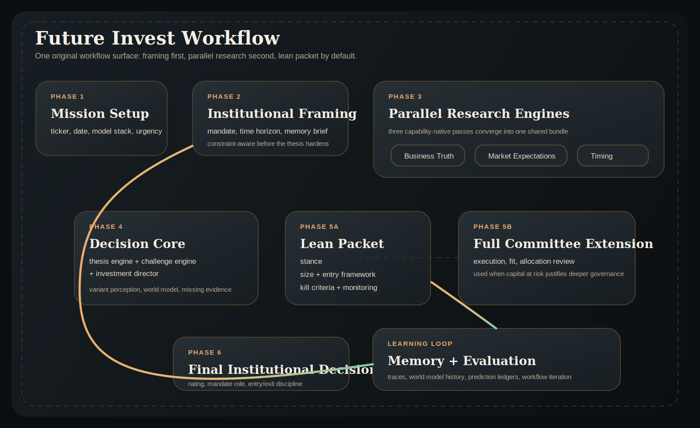

# Future Invest Pitch Memo

## Title

**Future Invest: Building the Operating System for the Next Investment Institution**

## Executive Thesis

Most AI products in investing are still built like better research assistants. They summarize filings, search news, or simulate a team of human analysts. That is useful, but it does not solve the deeper institutional problem: investment firms are not bottlenecked only by information retrieval. They are bottlenecked by the conversion of fragmented insight into capital-aware decisions, timing, and learning.

Future Invest is designed to solve that problem. It is not positioned as a better analyst copilot. It is positioned as the operating system for an AI-native investment institution: one that combines deep fundamental understanding, faster timing and catalyst capture, explicit portfolio constraints, and institutional memory that compounds over time.

The core claim is simple: the next great investment firm will not be built by adding one more model to a legacy workflow. It will be built by redesigning the workflow itself.

## Why This Product Window Matters

Three forces make this moment unusually attractive.

### 1. LLMs are finally strong enough to support modular investment cognition

Foundation models can now synthesize long context, reason across multiple evidence types, and produce structured outputs that are usable downstream. This makes it feasible to decompose investment work into coordinated capability modules rather than isolated one-shot prompts.

### 2. Current multi-agent finance systems remain shallow

Most systems in the market still mirror human roles: analyst, trader, risk manager, PM. That framing is intuitive, but it remains too static, too report-centric, and too weakly linked to real capital allocation. The gap between “multi-agent demo” and “institution that compounds” remains large.

### 3. Investment organizations are ready for a new operating model

The best long/short firms increasingly need both:

- deep business truth and long-horizon variant perception,
- fast timing, catalyst awareness, and portfolio discipline.

These strengths typically live in different organizational traditions. Future Invest is built to unify them.

## The Problem We Are Solving

Legacy investment workflows suffer from four structural weaknesses.

### A. Research and capital allocation are too separated

Firms often decide what they think first and how to size it later. That separation is costly. A trade is not only a thesis; it is also a role inside a portfolio.

### B. Time horizons are often blurred

Many systems fail to distinguish:

- long-cycle mispricing,
- medium-cycle re-rating,
- short-cycle execution window.

That is exactly how “great company” gets confused with “great trade right now.”

### C. Institutions do not learn fast enough

Most AI agents are effectively stateless. They do not retain durable company-level memory, prediction ledgers, or evidence on which engines perform best in which regimes.

### D. Multi-agent systems are still workflow replicas, not institution designs

They imitate an org chart instead of redesigning the institution around machine-native strengths.

## What Future Invest Is

Future Invest is an AI-native investment institution built around a lean-first workflow with a full committee extension when deeper review is required.

### 1. Mission Setup

The operator defines the instrument, date, mandate intensity, and model configuration.

### 2. Institutional Framing

Before deep research begins, the system constructs:

- a **Portfolio Mandate**,
- a **Time Horizon Split**,
- an **Institutional Memory Brief**.

This means the system starts with portfolio role, capital budget, and historical context already in view.

### 3. Capability-Native Research Stack

Research is organized by investment function rather than by legacy job title:

- **Business Truth**
- **Market Expectations**
- **Timing & Catalysts**

These capabilities populate a shared dossier rather than isolated memos.

### 4. Decision Core

The system synthesizes the research stack through:

- **Thesis Engine**
- **Challenge Engine**
- **Investment Director**

This produces a coherent world model, explicit counterevidence, and an investable thesis.

### 5. Lean Position Construction, Full Committee Review, and Learning

The default path converts the thesis directly into:

- a **Position Construction Packet**,
- explicit **Kill Criteria**,
- **Monitoring Triggers**,
- and a write-back into **Institutional Memory**.

When deeper review is required, the system expands into:

- an **Execution State**,
- an **Allocation Review**,
- a **Final Decision**,
- and a write-back into **Institutional Memory**.

This turns analysis into capital formation rather than stopping at narrative output.

## Workflow

The current workflow is visualized in [future-invest-workflow.svg](/Users/x/Desktop/my_aider_code/codex/TradingAgents/assets/future-invest-workflow.svg).

## What We Are Deliberately Emphasizing

This is the most important section for understanding the project’s positioning.

### 1. We are building an institution, not a chatbot

The product is not “AI for stock research.” The product is a new institutional workflow for generating, challenging, sizing, and learning from investment decisions.

### 2. We are combining two historically separate strengths

Future Invest is explicitly trying to merge:

- the depth and industry understanding of fundamental long/short research,
- the speed, timing, and portfolio discipline of platform-style investing.

This is a structural combination, not a branding claim.

### 3. Portfolio context comes early, not late

The system does not ask “what do we think?” and only later ask “how much do we size?” It starts with role, budget, fit, crowding, and correlation in view.

### 4. Time horizons are treated as different problems

Long-cycle mispricing, medium-cycle re-rating, and short-cycle execution are separated on purpose. This is a design choice with direct investment consequences.

### 5. Memory is a core asset

Future Invest stores world-model history, thesis history, prediction records, and agent reliability. That means the institution can improve as an institution, not just as a prompt chain.

### 6. Evaluation is part of the product

The system already includes a batch evaluation harness. This matters because many AI products in finance look impressive in demos but are hard to compare, audit, or improve systematically.

## Why This Can Become a Defensible System

Future Invest has three potential sources of defensibility.

### 1. Workflow defensibility

The advantage is not a single model call. It is the architecture that determines how models, capital constraints, memory, and decision protocols interact.

### 2. Memory defensibility

As the institution accumulates company-level history, prediction ledgers, and engine reliability signals, the value of the system should compound.

### 3. Evaluation defensibility

A strong investment system needs a feedback loop. The teams that can evaluate and refine institutional workflows fastest will likely outperform teams that only add more prompts and more agents.

## What This Is Not

Future Invest is not currently claiming to be:

- a turnkey production trading stack,
- a complete replacement for human portfolio managers,
- a finished execution platform with live order-routing infrastructure,
- or a guaranteed source of alpha.

The current opportunity is earlier-stage and more foundational: to build the operating system layer that future investment organizations can run on top of.

## Near-Term Milestones

The current codebase already includes:

- a canonical institutional state schema,
- dynamic orchestration,
- front-loaded portfolio mandate and time-horizon split,
- institutional memory,
- CLI and web interfaces,
- a batch evaluation harness.

The next milestones are clear:

1. tighten the lean loop so more real runs converge to a final packet without operator rescue,
2. make the portfolio layer more state-driven and less textual,
3. enrich the data layer and realized-outcome measurement,
4. run structured A/B evaluation across historical cases.

## Bottom Line

Future Invest matters because it changes the unit of design. Instead of treating AI as a better analyst, it treats AI as the substrate for a better investment institution.

That is the pitch:

> We are not building another AI finance tool.  
> We are building the operating system for the next generation of investment firms.
