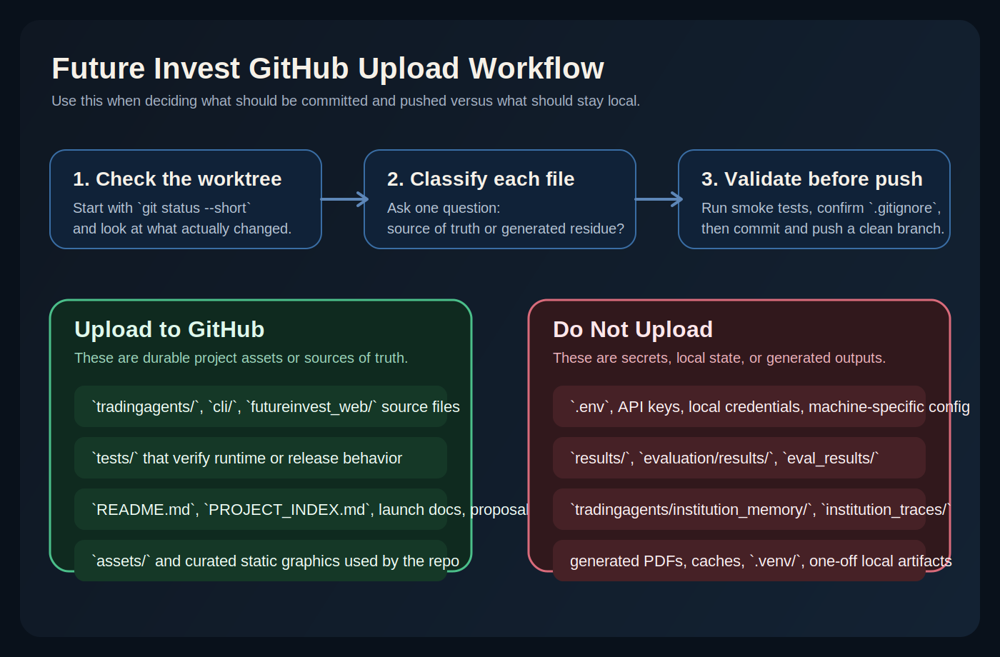

# Future Invest GitHub Upload Guide

Use this guide when deciding what belongs in a Git commit and what should stay local.

## Workflow

1. Run `git status --short`.
2. Classify each changed path as either source of truth or generated/local residue.
3. Keep only durable project assets in the commit.
4. Run the smoke tests before pushing.
5. Push only when the worktree is clean and `.gitignore` is doing its job.

## Should Upload

- Source code in `tradingagents/`, `cli/`, and `futureinvest_web/`
- Tests in `tests/`
- Durable docs like `README.md`, `PROJECT_INDEX.md`, `docs/*.md`, `docs/*.tex`, `docs/*.html`
- Curated static assets in `assets/` and `futureinvest_web/static/`
- Intentional release-support files such as launch checklists or release copy

## Should Not Upload

- Secrets and local config such as `.env`, API keys, or machine-specific credentials
- Runtime outputs in `results/`, `evaluation/results/`, and `eval_results/`
- Institutional state in `tradingagents/institution_memory/` and `tradingagents/institution_traces/`
- Local environments like `.venv/`
- Generated caches under `data_cache/`, pytest caches, coverage files, and similar local artifacts
- Newly generated PDFs and one-off local exports unless you deliberately want them as curated release assets

## Repo-Specific Notes

- The current `.gitignore` already blocks the main generated output directories and local secrets.
- `docs/*.pdf` is ignored, so source documents should be committed instead of regenerated PDF outputs.
- If a file is both generated and reproducible from committed source, prefer committing the source and excluding the output.
